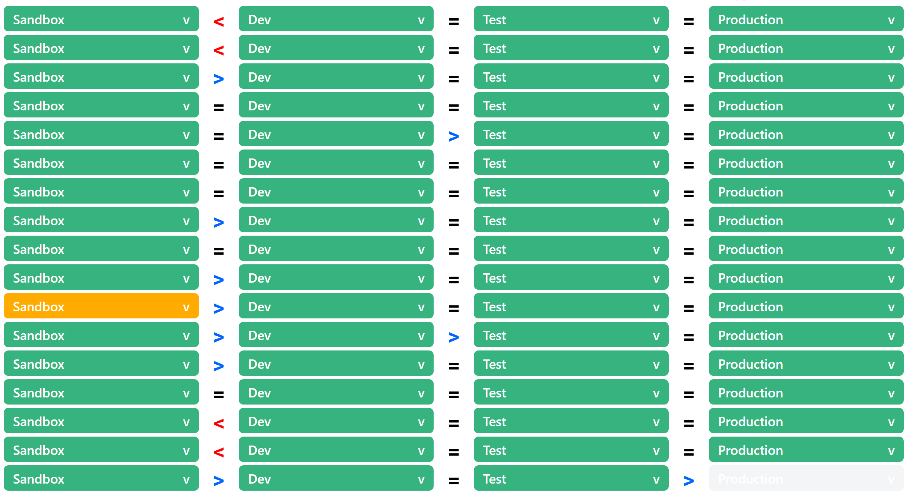

# Atlassian.Bitbucket

See [PowerShell Gallery](https://www.powershellgallery.com/packages/Atlassian.Bitbucket) for more information.

## Build Status

| Windows                                                                                                                                                                                                                                                                                              | Linux                                                                                                                                                                                                                                                                                                       | macOS                                                                                                                                                                                                                                                                                                      |
| ---------------------------------------------------------------------------------------------------------------------------------------------------------------------------------------------------------------------------------------------------------------------------------------------------- | ----------------------------------------------------------------------------------------------------------------------------------------------------------------------------------------------------------------------------------------------------------------------------------------------------------- | ---------------------------------------------------------------------------------------------------------------------------------------------------------------------------------------------------------------------------------------------------------------------------------------------------------- |
| [](https://beyondcomputing.visualstudio.com/PowerShell%20Modules/_build/latest?definitionId=6&branchName=master) | [](https://beyondcomputing.visualstudio.com/PowerShell%20Modules/_build/latest?definitionId=6&branchName=master) | [](https://beyondcomputing.visualstudio.com/PowerShell%20Modules/_build/latest?definitionId=6&branchName=master) |

## Using The Module

### Installation

Run the following command in an elevated PowerShell session to install the module from the PowerShell Gallery.

```powershell
Install-Module Atlassian.Bitbucket
```

### Update

If you already have the module installed, run the following command in an elevated PowerShell session to update the module from the PowerShell Gallery to the latest version.

```powershell
Update-Module Atlassian.Bitbucket
```

### Authentication

The module provides session level authentication with optional machine / user encrypted persistance between sessions.

#### Authentication Methods

The module supports both Basic authentication and OAuth 2.0 for the Bitbucket API's.

#### How To Login

##### Basic Auth

For basic auth I recommend you use [App Passwords](https://bitbucket.org/account/settings/app-passwords/) along with your username.  When generating the App Password make sure to include read access to the account and workspace membership for login validation.

```powershell
Login-Bitbucket
```

##### OAuth 2.0

For OAuth 2.0 Login you will need two sets of credentials.

1. Your Atlassian credentials: `email` and `password`
2. Key and Secret for [OAuth Consumer](https://confluence.atlassian.com/bitbucket/oauth-on-bitbucket-cloud-238027431.html#OAuthonBitbucketCloud-Createaconsumer).

```powershell
$Cred = Get-Credential -UserName '<Email>'
$OAuth = Get-Credential -UserName '<OAuth Consumer Key>'

Login-Bitbucket -AtlassianCredential $Cred -OAuthConsumer $OAuth
```

#### Persistence

Use `Login-Bitbucket -Save` when logging in or `Save-BitbucketLogin` at any time to save the information to an encrypted file that will be automatically loaded when you start a new session.

#### Teams

The module will automatically select your team if you have 1 when logging in or prompt you to choose from a list of teams. Cmdlets will default to the team selected unless specified. If you wish to change the team run `Select-BitbucketTeam`. If you want to save the change run `Save-BitbucketLogin` again.

### CMDLETs

To get more information on each cmdlet run `Get-Help <CMDLET Name>`

#### Authentication CMDLETs

- `Get-BitbucketLogin`
- `Get-BitbucketSelectedTeam`
- `Get-BitbucketTeam`
- `New-BitbucketLogin`
- `Remove-BitbucketLogin`
- `Save-BitbucketLogin`
- `Select-BitbucketTeam`

#### Pipeline CMDLETs

- `Enable-BitbucketPipelineConfig`
- `Get-BitbucketPipelineConfig`
- `Start-BitbucketPipeline`
- `Wait-BitbucketPipeline`

#### Project CMDLETs

- `Get-BitbucketProject`

#### Pull Request CMDLETs

- `Get-BitbucketPullRequest`
- `Get-BitbucketPullRequestComment`
- `New-BitbucketPullRequest`
- `New-BitbucketPullRequestComment`

#### Repository CMDLETs

- `Get-BitbucketRepository`
- `New-BitbucketRepository`
- `Remove-BitbucketRepository`
- `Set-BitbucketRepository`

##### Deployment CMDLETs

- `Get-BitbucketRepositoryDeployment`

##### Environment CMDLETs

- `Get-BitbucketRepositoryEnvironment`
- `New-BitbucketRepositoryEnvironment`
- `Remove-BitbucketRepositoryEnvironment`

##### Permission CMDLETs

- `Add-BitbucketRepositoryGroupPermission`
- `Get-BitbucketRepositoryGroupPermission`
- `New-BitbucketRepositoryGroupPermission`
- `Remove-BitbucketRepositoryGroupPermission`
- `Set-BitbucketRepositoryGroupPermission`

##### Restriction CMDLETs

- `Add-BitbucketRepositoryBranchRestriction`
- `Get-BitbucketRepositoryBranchRestriction`
- `New-BitbucketRepositoryBranchRestrictionMergeCheck`
- `Remove-BitbucketRepositoryBranchRestriction`
- `Set-BitbucketRepositoryBranchRestriction`

##### Reviewer CMDLETs

- `Add-BitbucketRepositoryReviewer`
- `Get-BitbucketRepositoryReviewer`
- `Remove-BitbucketRepositoryReviewer`
- `Set-BitbucketRepositoryReviewer`

##### Variable CMDLETs

- `Get-BitbucketRepositoryVariable`
- `New-BitbucketRepositoryVariable`
- `Remove-BitbucketRepsitoryVariable`

### User CMDLETs

- `Add-BitbucketUserToGroup`
- `Get-BitbucketUser`
- `Get-BitbucketUsersByGroup`
- `Get-BitbucketUserGroup`

#### Reports

- `Get-BitbucketProjectDeploymentReport`

##### HTML Formatted Report Example
* The screenshot doesn't show the repo names or expanded cards.  When expanded the cards show the pipeline #, last commit and date and are clickable to take you directly to the pipeline run in Bitbucket.


## Changes

See [CHANGELOG](CHANGELOG.md) for more information.

## Contributing

See [CONTRIBUTING](CONTRIBUTING.md) for more information.

## License

See [LICENSE](LICENSE.md) for more information.
